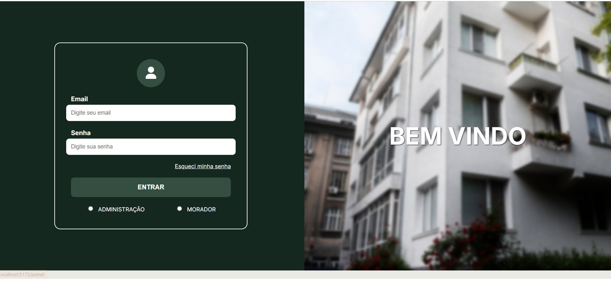
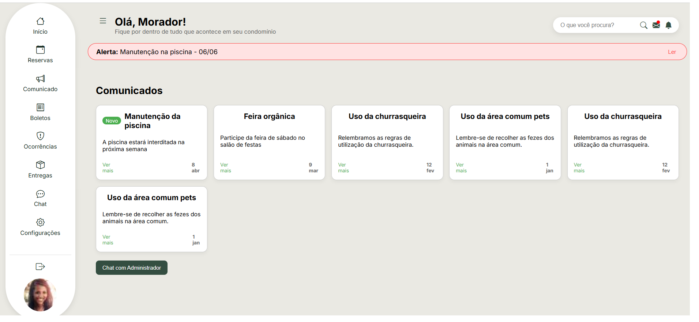
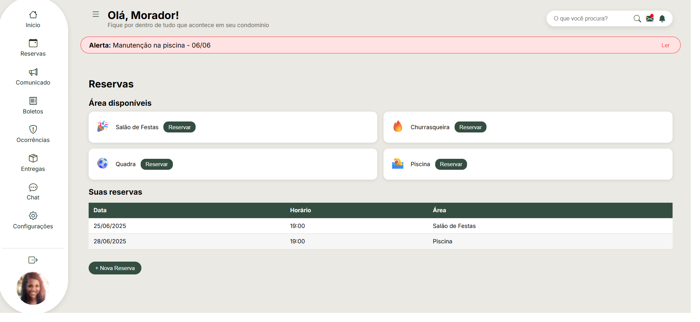
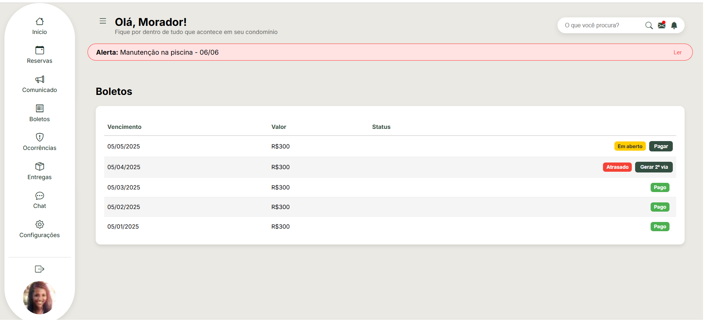
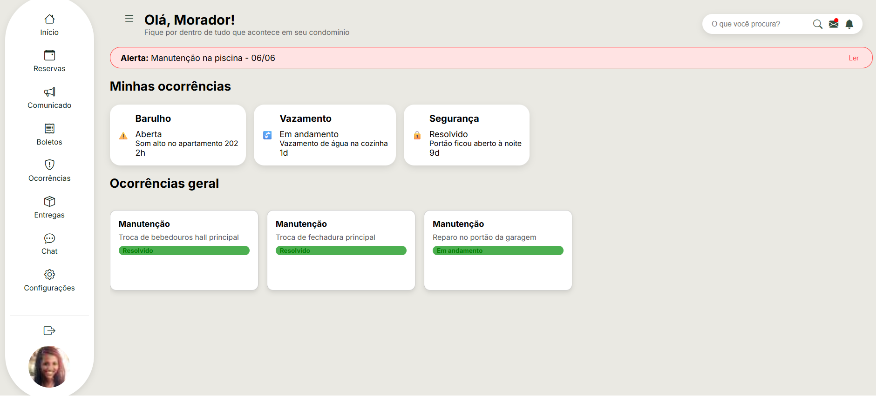
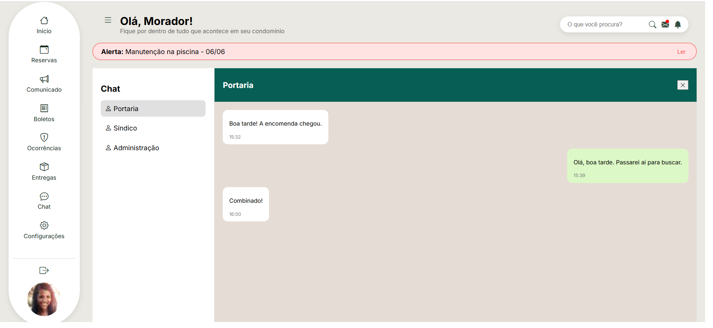
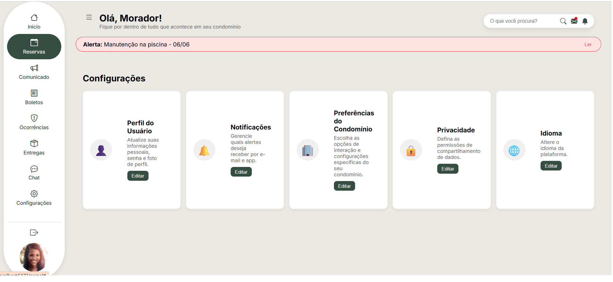

# 🏢 Meu Condomínio

Sistema de gestão condominial desenvolvido com Vue.js e Vite.

## 🖼️ Prévia do Sistema

### 🏠 Início


### 🔐 Login


### 📬 Comunicados


### 📅 Reservas


### 🧾 Boletos


### 📦 Entregas/Ocorrências


### 💬 Chat


### ⚙️ Configurações


---

## 🚀 Como rodar o projeto

### ✅ Pré-requisitos

- Node.js instalado: [https://nodejs.org](https://nodejs.org)
- Terminal (PowerShell, Git Bash ou CMD)

### 📦 Instalação e execução

```bash
# Clone o repositório
git clone git@github.com:AnaClara0813/MeuCondominio.git

# Acesse a pasta
cd MeuCondominio

# Instale as dependências
npm install

# Rode o projeto
npm run dev
